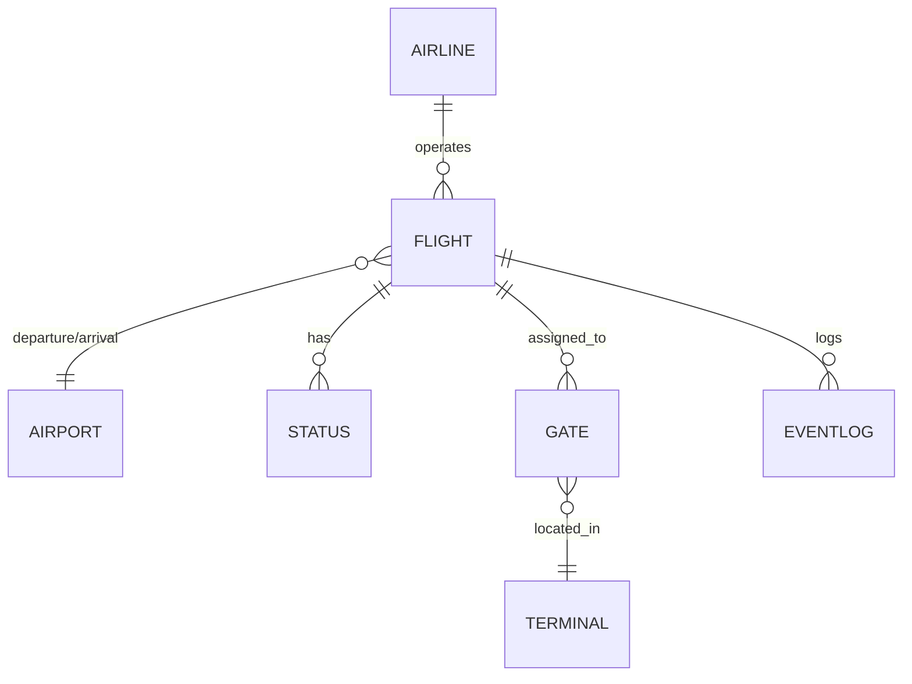

# Информационная система для аэропорта: терминал отображения рейсов

## Целевая аудитория
- **Пассажиры аэропорта**  
- **Сотрудники справочных и информационных служб**
- **Операторы и диспетчеры аэропорта**

## Задачи, решаемые ИС
1. Автоматизированное отображение расписания вылетов и прилётов в режиме реального времени  
2. Информирование о статусах рейсов: по расписанию, регистрация, посадка, задержан, отменён  
3. Поиск рейса по номеру, пункту отправления или назначения  
4. Автоматическое обновление данных с серверов авиакомпаний и служб аэропорта  
5. Вывод дополнительной информации: номер выхода (gate), время начала регистрации, примечания  

## Аналоги на рынке
- **FIDS (Flight Information Display System)**  
  Стандартные табло во всех крупных аэропортах  
- **Amadeus Airport IT**  
  Комплекс модулей для диспетчерской и пассажирской информации  
- **SITA Airport Management**  
  Решения для визуального информирования и управления ресурсами  
- **InformAir**  
  Облачное решение для табло рейсов и push-уведомлений  

## Контекстная диаграмма

```mermaid
graph LR
    P[Пассажиры (просмотр, поиск рейсов)] --> T[Терминал ИС (отображение расписания, статусов)]
    O[Операторы/службы аэропорта (ввод данных, обновление)] --> T
    T --> P
    T --> O
```

## Дерево функциональной модели
```
A0 – Информирование о рейсах
├─ A1 – Загрузка и синхронизация расписания
├─ A2 – Отображение списка вылетов и прилётов
├─ A3 – Обновление статусов рейсов
├─ A4 – Поиск рейса по параметрам
└─ A5 – Логирование событий и изменение данных
```

## Сущности

- **Flight**  
  `id`, `flight_number`, `airline_id`, `departure_airport_id`, `arrival_airport_id`,  
  `scheduled_time`, `actual_time`, `status_id`, `gate_id`, `remarks`
- **Airline**  
  `id`, `name`, `code`
- **Airport**  
  `id`, `name`, `city`, `country`, `code`
- **Status**  
  `id`, `name` (_По расписанию, Регистрация, Посадка, Задержан, Отменён_)
- **Gate**  
  `id`, `number`, `terminal_id`
- **Terminal**  
  `id`, `name`
- **EventLog**  
  `id`, `flight_id`, `event_time`, `event_type`, `description`

## Схема данных



## Планируемые запросы
- Получить все рейсы на текущую дату с их статусами  
- Вывести ближайшие вылеты/прилёты (например, следующие 5)  
- Найти рейсы конкретной авиакомпании за период  
- Отобразить задержанные рейсы за последние 12 часов  
- Поиск рейса по номеру или пункту назначения  
- Сформировать статистику по количеству рейсов в каждом статусе  
- Добавить новую запись в лог изменения статуса рейса  
- Обновить статус и время фактического вылета/прилёта рейса  

## Пример SQL-запроса

```sql
SELECT 
    f.flight_number,
    a.name           AS airline,
    d_airport.name   AS departure,
    a_airport.name   AS arrival,
    f.scheduled_time,
    f.actual_time,
    s.name           AS status,
    g.number         AS gate
FROM Flight f
JOIN Airline a 
    ON f.airline_id = a.id
JOIN Airport d_airport 
    ON f.departure_airport_id = d_airport.id
JOIN Airport a_airport 
    ON f.arrival_airport_id = a_airport.id
JOIN Status s 
    ON f.status_id = s.id
LEFT JOIN Gate g 
    ON f.gate_id = g.id
WHERE DATE(f.scheduled_time) = CURRENT_DATE
ORDER BY f.scheduled_time;
```